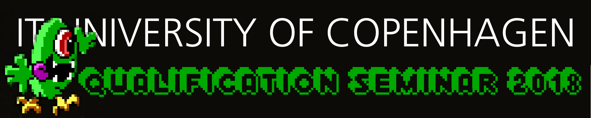

# Qualfication seminar teaching materials 2018

This repository contains the course materials for the lectures of the qualification seminar.
The sessions will be released as they are presented in the course.

## Content

Here you can find literature, lecture materials, homework, homework solutions
and lecture screencasts.

The content is divided into folders, where each folder contains the relevant
material for that session.
For the first three sessions, please refer to the project description on how
to open and access the material.
For the remainder of the sessions the project description contains information
on how to work with the files directly through git.
Please refer to the session 4 lecture screencast, if you don't know what this means.

## Schedule

The first day Monday 9/7/2018, we will have tea, coffee, and croissants from 8:30 to 9:00 in front of Auditorium 1 before the start of the seminar.

| Date      | Lecture       | Place | Workshop      | Place | Topic  
|---------- | ------------- | ----- | ------------- | ----- | -------------------------- |
| 9/7/2018  | 09:00 - 13:00 | Aud 1 | 13:00 - 15:00 | Scrollbar and DesignLab | 1: Writing your first program! |
| 11/7/2018 | 09:00 - 13:00 | Aud 1 | 13:00 - 15:00 | Scrollbar and DesignLab | 2: Basic Python syntax |
| 13/7/2018 | 09:00 - 13:00 | Aud 1 | 13:00 - 15:00 | Scrollbar and DesignLab | 3: Python building blocks |
| 16/7/2018 | 09:00 - 13:00 | Aud 1 | 13:00 - 15:00 | Scrollbar and DesignLab | 4: Commanding the lines |
| 18/7/2018 | 09:00 - 13:00 | Aud 1 | 13:00 - 15:00 | Scrollbar and DesignLab | 5: Working with files and objects |
| 20/7/2018 | 09:00 - 13:00 | Aud 1 | 13:00 - 15:00 | Scrollbar and DesignLab | 6: Working with data and git |
| 23/7/2018 | 09:00 - 13:00 | Aud 1 | 13:00 - 15:00 | Scrollbar and DesignLab | 7: Algorithms and runtimes |
| 25/7/2018 | 09:00 - 13:00 | Aud 1 | 13:00 - 15:00 | Scrollbar and DesignLab | 8: Abstract data types |
| 27/7/2018 | 09:00 - 13:00 | Aud 1 | 13:00 - 15:00 | Scrollbar and DesignLab | 9: Trees and graphs |
| 30/7/2018 | 09:00 - 13:00 | Aud 1 | 13:00 - 15:00 | Scrollbar and DesignLab | 10: Network and webservers |
| 1/8/2018 | 09:00 - 13:00 | Aud 1 | 13:00 - 15:00 | Scrollbar and DesignLab | 11: Project 1/2 |
| 3/8/2018 | 09:00 - 13:00 | Aud 1 | 13:00 - 15:00 | Scrollbar and DesignLab | 12: Project 2/2 |

### Literature

The seminar uses two books, both of which are available in print form at a modest cost. You should before the seminar starts get at least one of the two course books, either in electronic form or in print.

  * Al Sweigart: _Automate the Boring Stuff with Python_ (https://www.nostarch.com/automatestuff)
  * Eric Matthes: _Python Crash Course. A Hands-On, Project-Based Introduction to Programming_. (https://nostarch.com/pythoncrashcourse)

The main book _"Automate the Boring Stuff with Python"_ can be accessed for free online, see http://automatetheboringstuff.com.

For three of the later chapters we will use the book _"Problem Solving with Algorithms and Data Structures using Python"_, which is free available online at http://interactivepython.org/courselib/static/pythonds/.

We expect that you at least have a look at the literature before the lecture.
The following table maps the lectures to book contents.
Please prepare for a lecture by reading the literature in at least one of the
books.

| Date      | Topic | _Automate the Boring Stuff_ | _Python Crash Course_ | _Problem Solving [...] using Python_
|---------- | ------------- | ----- | ------| ---- |
| 9/7/2018  | Introduction | Chapter 1 and 2 | Chapter 1, 2 and 5 | - |
| 11/7/2018 | Basic Python syntax | Chapter 2 and 4 | Chapter 3, 4 and 7 | - |
| 13/7/2018 | Python building blocks | Chapter 3 | Chapter 7 and 8 | - |
| 16/7/2018 | Commanding the lines | Chapter 10 | Chapter 10 and 11 | - |
| 18/7/2018 | Working with files and objects | Chapter 9 and 12 | Chapter 9 | - |
| 20/7/2018 | Working with data and git | Chapter 11 and 15 | - | - |
| 23/7/2018 | Algorithms and runtimes | - | - | Chapter 2 |
| 25/7/2018 | Abstract data types | - | - | Chapter 3 & 5 |
| 27/7/2018 | Trees and graphs | - | - | Chapter 6 & 7 |
| 30/7/2018 | Network and webservers | - | - | - |
| 1/8/2018 | Project 1/2 | - | - | - |
| 3/8/2018 | Project 2/2 | - | - | - |

### Screencasts

All sessions will be screencast via [Ilos](ilosvideos.com) within this folder: 
https://app.ilosvideos.com/content/r8HlHd3Knj0Z

## Repository structure
The session folders contains the code the code
(either as Python or Jupyter notebook files) and data files that have been
presented in a single session.
The `README.md` file inside each folder explains how to access the content of the session,
including screencasts and a mapping to the course literature (which we expect
that you at least skim!).

The `homework` directory contains code and content related to exercises for
the class workshops and for home. Note that the homework descriptions for the
first three sections, are contained in a `Assignment.ipynb` Jupyter notebook.

After the deadline of each exercise has passed, we will publish suggested
solutions to the `homework_solutions` directory.

## Contact

Please refer to the Q&A forum on LearnIT.

Teachers: `<ropf@itu.dk>` or `<jegp@itu.dk>`
