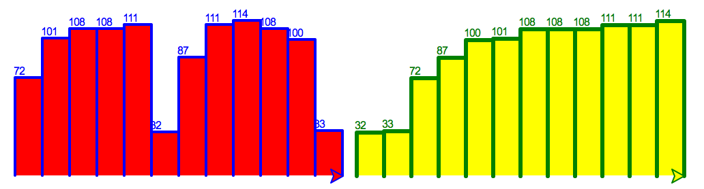

# Part 1: Searching

## 1.1: Searching for an index

In this part of the assignment, we discuss algorithms that find a given element in a list. More precisely:

**Input**: A list `l`, an element `x` to search for.

**Output**: An index `idx` such that `l[idx] == x`, or `-1` if `x` is not present in `l`. If `x` occurs more than once, the first occurrence is reported.

The following has to work: 

```python 
> where_is([1, 3, 5], 3)
1
> where_is([1, 2, 4, 5, 4], 4)
2
> where_is([1, 2, 3], 0)
-1
```

* Hint: **Always** do things in **small** steps:
  1. Break down the problem: What is the first thing you need?
     * This sub-problem should **not be more than 1-2 lines of code!**
  2. Solve that first problem **until you have something that works
  3. Continue with the next sub-problem
* Hint: Start by writing a function that takes the requested input and simply prints back `-1`. 
  * This is two lines of code

# Part 2: Runtime Analysis

## 2.1: Best- and worst-case runtimes (without running the code)

Copy and run the following code in a notebook (`$ jupyter notebook`) or in an interactive Python session (`$ ipython`):

```python
def find_element_in_a_list(data_list, element):
    for idx, el in enumerate(data_list):
        if el == element:
            return idx, el


data_list = range(10000)
%timeit find_element_in_a_list(data_list, 5000)
```

1. What is the best case for `find_element_in_a_list` when the data_list is [0, 1, ..., 9999]?
2. What is the worst case for `find_element_in_a_list` when the data_list is [0, 1, ..., 9999]?
3. Let's say `find_element_in_a_list` is run with a list of size `n`. The worst-case runtime `T(n)` is one of the following choices a-d, write down which one:

        a. constant
        b. linear
        c. quadratic
        d. exponential


## 2.2: Runtime analysis

Consider the following variant of `find_element_in_a_list`:

```python
def find_element_in_a_list2(data_list, element):
    for idx, el in enumerate(data_list):
        if el == element:
            first_result_idx = idx
            break
    for idx, el in enumerate(data_list):
        if el == element and idx == first_result_idx:
            return idx, el
```

Let's say `find_element_in_a_list2` is run with a list of size `n` . The worst-case runtime  $T(n)$  is one of the following choices a.-d., write down which one:

    a. constant
    b. linear
    c. quadratic
    d. exponential

# Part 3: Sorting

## 3.1: Bubble sort

Copy and run the following code in a notebook:

```python
def bubble_sort(data_list):
    for passnum in range(len(data_list) - 1, 0, -1):
        for idx in range(passnum):
            if data_list[idx] > data_list[idx + 1]:
                temp = data_list[idx]
                data_list[idx] = data_list[idx + 1]
                data_list[idx + 1] = temp


data_list = [54, 26, 93, 17, 77, 31, 44, 55, 20]
bubble_sort(data_list)
print(data_list)
```

1. Discuss the following statement: _If during a run of the loop `for idx in range(passnum):` no elements are exchanged, then the input is sorted._
2. (**Optional**): How can you adapt the implementation above to use this knowledge?

## 3.2: Bubble sort performance

Run the `bubble_sort` function with the following ways using `timeit` as seen in class.
- `bubble_sort(list(reversed(range(100))))`
- `bubble_sort(list(reversed(range(1000))))`
- `bubble_sort(list(reversed(range(10000))))`

Write down the expected output. Discuss the measured times: Is that to be expected?

Expected: Running times should differ by a factor of 100.

## Part 4: (**Optional**) Insertion sort

1. *Insertion Sort* is another basic sorting algorithm. Watch https://www.youtube.com/watch?v=ROalU379l3U and describe the method that is used to sort a given input. 
2. Implement *Insertion Sort* as function `insertion_sort(data_list)`.
3. Compare the behavior of *Insertion Sort* to *Bubble Sort* on a well-chosen `data_list` input. 

## Part 5: (**Optional**) Searching a sorted list

From now we assume that the lists we want to search are sorted, e.g., by calling `sorted(l)` on the list `l`. Searching a sorted list can be done much faster using the following idea: Let's say we want to search a sorted list `l` with `n` entries for an element `x`.
1. Set `left = 0` and `right = n - 1`.
2. While `left <= right` do the following:
   1. Compute `middle = (left + right) / 2`.
   2. Check if `l[middle]` is `x`: If yes, return `middle`. 
   3. if `x < l[middle]`, set `right = middle - 1`.
   4. if `x > l[middle]`, set `left = middle + 1`.
3. Return `-1`, i.e., the element is not found if `left > right`.

A visualization of this method is given in the picture below. Each arrow points to a location that is inspected. The array is searched for the value `54`.


1. Write a function `binary_search(data_list, element)` that implements the algorithm described above.
2. Test the correctness of your implementation by calling `binary_search` with different inputs for `data_list` and `element`. Write down the inputs that you have used.
3. Use `%timeit` to measure the running time of `binary_search`. The **worst-case runtime** of the function is mentioned in "Analysis of Algorithms". Which one is it?


# Alternative to Part 4 and 5

The purpose of this task is to let you repeat things that you already know and to let you improve your coding skills.


Write a command-line program `turtle_barchart.py`, which creates a barchart using turtle graphics.

Let's say the input data four your program is the following list of characters stored in the variable `data`:

```python
data = ['H', 'e', 'l', 'l', 'o', ' ', 'W', 'o', 'r', 'l', 'd', '!']
```

Use a loop and the `ord` function to convert the list of characters into a list of numbers. That is, after conversion a list `numerical_data` should contain the following:

```python
numerical_data == [72, 101, 108, 108, 111, 32, 87, 111, 114, 108, 100, 33]
```

Now, create two functions to draw a bar chart out of those numbers, one function shall plot the sorted `numerical_data` and another one shall plot the unsorted `numerical_data`. 

That is, your program should make use of two turtles, which plot something similar to the following:



Structure your program so that each bar is drawn via a function `draw_bar(t, height, width=20)` which takes an instance `t` of a `Turtle`, the `height` of the bar as integer and the width of the bar as integer argument with default value.
